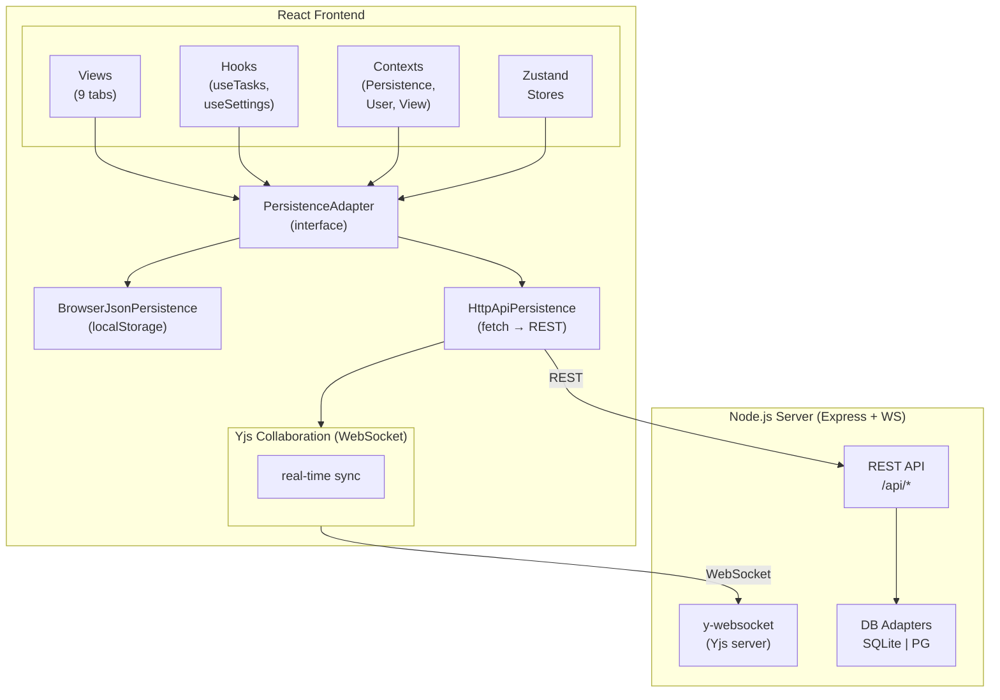

<div align="center">
  
</div>

# P3Fo ("P-Fo") – short for Plan, Program, Project, and Focus on what matters

A comprehensive productivity and team-management tool built with React, TypeScript, and an optional Node.js backend. P3Fo supports **dual-mode persistence** — run it as a pure static SPA with browser storage, or deploy it with a server for SQLite/PostgreSQL persistence and real-time collaboration.

---

## 🚀 Features

### Core Functionality
- **Multiple View Modes**: 9 views — Celebration, Dream, Plan, Program, Project (Kanban), Focus, Timetable, Metrics, and Settings
- **Task Management**: Hierarchical task organization with parent-child relationships
- **Time Tracking**: Built-in start/stop timer per task with multi-entry time logs
- **Calendar Integration**: Program tasks in a calendar view
- **Notification & Reminders**: Persistent reminders with real-time notification center

### Advanced Features
- **Fertilization Board**: Collaborative brainstorming board with anonymous contributions, card linking, voting (Thumbs Up, Up/Down/Neutral, Points, Majority Judgment), moderator controls, hidden edition mode, and promote-to-backlog
- **Dream Board**: Long-term vision board with time-frame horizons (3mo → 4y), timeline view, and the same voting/collaboration system as Fertilization
- **Circles**: Organizational structure visualization known as [Company as Code](https://blog.42futures.com/p/company-as-code) with D3.js — roles, circles, groups, and organizations with zoom/pan, descriptions, purpose, domains, and accountabilities
- **Comparative Prioritization**: Pair-wise task comparison for intelligent priority ranking
- **Metrics Dashboard**: High-impact task frequency, failure rate, new-capabilities time ratio, hourly balance, vacations tracking, and forecast
- **Quality of Life Index (QLI)**: Per-user QoL survey with cross-user analytics
- **Data Management**: Full JSON export/import for backup and migration, with per-user granularity
- **Multi-User Support**: User management with per-user settings, workload, monthly balances, and timezone
- **Theme Support**: Dark/light mode with `next-themes`

---

## 🏗️ Architecture

### High-Level Overview



### Persistence Factory (Dual-Mode)

The app selects its persistence backend **at runtime** via `persistence-factory.ts`:

1. If `VITE_P3FO_FORCE_BROWSER=true` → **BrowserJsonPersistence** (localStorage/sessionStorage)
2. Else if `VITE_P3FO_API_URL` is set → health-check the backend (`GET /api/health`)
   - If healthy → **HttpApiPersistence** (REST calls to Node server)
   - If unreachable → fallback to **BrowserJsonPersistence**
3. Else → **BrowserJsonPersistence** (default for static deploys)

Both adapters implement the unified `PersistenceAdapter` interface covering: Tasks, User Settings, App Settings, QoL Survey, Filters, Fertilization Board, Dream Board, and Circles.

### Real-Time Collaboration (Yjs)

When the server is available, P3Fo uses **Yjs** with a WebSocket provider for CRDT-based real-time sync:

| Shared Map            | Synced Data                    |
|-----------------------|--------------------------------|
| `tasks`               | Task CRUD operations           |
| `userSettings`        | User profiles across clients   |
| `fertilizationState`  | Fertilization board state      |
| `fertilizationCards`  | Fertilization cards            |
| `fertilizationColumns`| Fertilization columns          |
| `dreamState`          | Dream board state              |
| `dreamCards`          | Dream cards                    |
| `dreamColumns`        | Dream columns                  |
| `circles`             | Organizational circles         |
| `systemState`         | Global commands (e.g. Clear All)|

Collaboration is automatically disabled in browser-only mode.

### React Context Hierarchy

```
QueryClientProvider
  └─ TooltipProvider
       └─ PersistenceProvider (adapter selection)
            └─ UserProvider (current user identity)
                 └─ UserSettingsProvider (per-user settings + Yjs sync)
                      └─ ViewProvider (active view state)
                           └─ BrowserRouter + Routes
```

### Server Backend (`server/`)

A **Node.js / Express** server providing:

- **REST API** — Full CRUD for tasks, user settings, app settings, QoL survey, filters, fertilization board, dream board, and circles
- **Database Factory** — `createDbClient(type)` instantiates either:
  - `sqlite` adapter (via `better-sqlite3`, default)
  - `postgres` adapter (via `pg`)
- **WebSocket** — `y-websocket` for Yjs document synchronization
- **Static hosting** — Serves the Vite build in production with SPA fallback routing
- **Health check** — `GET /api/health` for monitoring and persistence auto-detection

### Event Bus & Metrics

- `EventBus` — Lightweight pub/sub for cross-component communication (tasks reload, filter changes, etc.)
- `metrics.ts` — Calculates high-impact task frequency, failure rate, time-on-new-capabilities, all scoped to configurable week windows

---

## 📋 Views

| View | Description |
|------|-------------|
| **Celebration** | Achievement showcase |
| **Dream** | Long-term vision board with time-frame horizons and voting |
| **Plan** | Strategic planning with comparative prioritization |
| **Program** | Calendar-based task scheduling (`react-big-calendar`) |
| **Project (Kanban)** | Visual kanban board with drag-and-drop |
| **Focus** | Detailed task & subtask management with active timer highlight |
| **Timetable** | Time-tracking analytics, hourly balance, and vacation charts |
| **Metrics** | Productivity dashboard (high-impact, failure rate, new capabilities, QoL, forecast) |
| **Settings** | App configuration, user management, data export/import |

---

## 🛠️ Tech Stack

| Layer | Technology |
|-------|-----------|
| **Frontend framework** | React 18 + TypeScript |
| **Build tool** | Vite 6 |
| **Styling** | Tailwind CSS + Shadcn/UI (Radix primitives) |
| **State management** | React Context, Zustand, React Query |
| **Routing** | React Router v6 |
| **Charts** | Recharts, D3.js (Circles) |
| **Calendar** | react-big-calendar + date-fns |
| **Real-time** | Yjs + y-websocket |
| **Server** | Express 4 |
| **Database** | SQLite (better-sqlite3) or PostgreSQL (pg) |
| **Containerization** | Docker (multi-stage build, non-root user) |
| **Task runner** | justfile |
| **Theming** | next-themes (dark/light) |

---

## 🚀 Quick Start

### Prerequisites
- Node.js 24+
- pnpm (recommended) or npm/yarn

### Installation

1. **Clone and install dependencies:**
   ```bash
   pnpm install
   ```

2. **Start development (frontend only — browser persistence):**
   ```bash
   pnpm dev
   ```

3. **Start development (frontend + backend with SQLite):**
   ```bash
   pnpm dev:all
   ```
   This runs both the Vite dev server and the Express backend concurrently.

4. **Build for production:**
   ```bash
   pnpm build
   ```

5. **Preview production build:**
   ```bash
   pnpm preview
   ```

6. **Lint code:**
   ```bash
   pnpm lint
   ```

### Environment Variables

| Variable | Default | Description |
|----------|---------|-------------|
| `VITE_BASE_URL` | `/` | Base URL path for the app (e.g. `/p3fo/` for GitHub Pages) |
| `VITE_P3FO_API_URL` | *(empty)* | Backend API URL; if set, enables server persistence |
| `VITE_P3FO_FORCE_BROWSER` | `false` | Force browser-only mode even if API URL is set |
| `P3FO_DB_CLIENT` | `sqlite` | Database engine: `sqlite` or `pg` |
| `P3FO_DB_SQLITE_FILE` | `./p3fo.db` | Path to the SQLite database file |
| `P3FO_DB_URL` | — | PostgreSQL connection string |
| `WS_TARGET` | `ws://localhost:5172` | WebSocket proxy target (dev mode) |
| `API_TARGET` | `http://localhost:5172` | API proxy target (dev mode) |

---

## 🐳 Docker Deployment

```bash
# Build and run with Docker Compose
docker compose up -d --build

# View logs
docker compose logs -f
```

The Docker image uses a **multi-stage build** (Node 24-slim), runs as a non-root `appuser`, and persists SQLite data in a named volume (`p3fo_data`).

Override database configuration via environment variables in `docker-compose.yml` or `.env`.

---

## 📂 Project Structure

```
p3fo/
├── server/                 # Node.js backend
│   ├── index.ts            # Express server + WebSocket + routes
│   └── db/
│       ├── index.ts         # DbClient interface + factory
│       ├── sqlite.ts        # SQLite adapter
│       └── postgres.ts      # PostgreSQL adapter
├── src/
│   ├── App.tsx              # Root component with context hierarchy
│   ├── main.tsx             # Entry point
│   ├── lib/
│   │   ├── persistence-types.ts    # Shared type definitions
│   │   ├── persistence-config.ts   # Runtime config from env vars
│   │   ├── persistence-factory.ts  # Adapter selection logic
│   │   ├── persistence-browser.ts  # Browser (localStorage) adapter
│   │   ├── persistence-http.ts     # HTTP (REST API) adapter
│   │   ├── PersistenceProvider.tsx  # React context provider
│   │   ├── collaboration.ts        # Yjs setup + shared maps
│   │   ├── events.ts               # EventBus (pub/sub)
│   │   └── metrics.ts              # Analytics calculations
│   ├── hooks/                # Custom React hooks (useTasks, useSettings, etc.)
│   ├── context/              # React context providers (User, UserSettings, View)
│   ├── components/           # UI components (views, boards, modals, etc.)
│   ├── pages/                # Route pages (Index, Metrics, Settings, NotFound)
│   ├── features/             # Feature modules (timer)
│   └── utils/                # Utilities (projectedHours, taskSorting, workingdays)
├── docker-compose.yml
├── Dockerfile
├── justfile                  # Build, deploy, and release recipes
├── vite.config.ts
└── package.json
```

---

## 📜 License

See [LICENSE](./LICENSE) for details.
